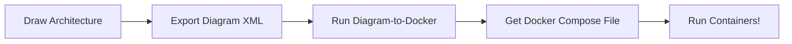

# Diagram-to-Docker: From Sketch to Docker Compose in Minutes

**For beginner and intermediate developers who want to skip the YAML headache and start coding faster.**

Tired of spending time writing and debugging Docker Compose files? With **Diagram-to-Docker**, you can draw your app’s architecture in diagrams.net (formerly Draw.io), and instantly turn it into a working `docker-compose.yaml`.

## 🎯 Who This Is For

This project is built for developers who:

* Are just starting with containers and don’t want to wrestle with YAML.
* Have a side project or hackathon app with multiple services (frontend, backend, database).
* Want to spin up Docker quickly and focus on writing code, not configs.
* Learn best by *seeing things run* instead of reading long docs.

If you’ve ever thought: *“I know what my app looks like, I just don’t know how to write Docker Compose for it,”* this tool is for you.

## 🚀 What It Does

* **Draw Your Architecture**: Use diagrams.net (or another tool that can export XML if you're brave).
* **Automatic Service Setup**: The tool recognizes common components like frontends, APIs, proxies, and databases.
* **Instant Compose File**: Generates a ready-to-run Docker Compose file with networking, volumes, and dependencies.

No YAML required — just draw and run.

## ⚡ Why It’s Useful

* ⏱️ **Save Time** – Go from diagram to running containers in seconds.
* 🛠️ **Skip Config Errors** – Stop copy-pasting broken YAML.
* 👩‍💻 **Onboard Faster** – Share diagrams and instantly get teammates running the same environment.
* 🌱 **Learn by Doing** – See how your diagram translates into Docker Compose.

## 🔧 How It Works

Example component recognition:

* **Frontend** → `react-frontend`
* **Backend** → `flask-backend`
* **Proxy** → `nginx`
* **Database** → `mysql`

## 🤝 Contributing

This started as a HackMIT 2025 project, but we’d love your input! If you’re learning Docker, this is a great project to get hands-on with.

---

**Stop writing YAML by hand. Draw it, run it, and get back to building.**
